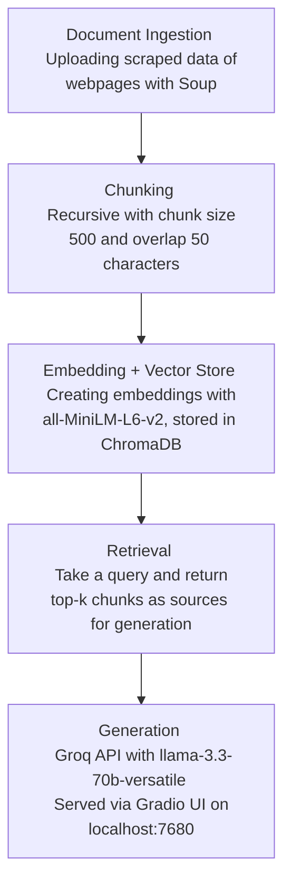

# Project 1 Planning: The Unofficial Guide

> Write this document before you write any pipeline code.
> Your spec and architecture diagram are what you'll use to direct AI tools (Claude, Copilot, etc.) to generate your implementation — the more specific they are, the more useful the generated code will be.
> Update the Retrieval Approach and Chunking Strategy sections if you change your approach during implementation.
> Update this file before starting any stretch features.

---

## Domain
I chose the On-Campus Dining domain for the University of Maryland, College Park. 
This knowledge is difficult to find because it is scattered across so many websites. Dining hall locations, prices, meal plans, cafes, hours, are all across 5-10+ websites, so this domain is perfect.

---

## Documents

| # | Source | Description | URL or location |
|---|--------|-------------|-----------------|
| 1 | UMD Dining — Dining Halls Overview | Hours, locations, and general info for all three dining halls | https://dining.umd.edu/hours-locations/dining-halls |
| 2 | UMD Dining — Door Prices | Walk-in meal prices for students, faculty, and guests | https://dining.umd.edu/home/hours-locations/dining-halls/door-prices |
| 3 | UMD Academic Catalog — Dining Services | Official overview of dining programs, meal plan types, and campus dining options | https://academiccatalog.umd.edu/undergraduate/campus-administration-resources-student-services/student-programs-services/dining-services/ |
| 4 | r/UMD — Charging in Dining Halls | Student discussion about phone/device charging availability in dining halls | https://www.reddit.com/r/UMD/comments/1sngnlo/charging_in_dining_halls/ |
| 5 | r/UMD — Meal Plan vs. Buying Food | Student thread comparing cost of meal plans vs. buying food independently | https://www.reddit.com/r/UMD/comments/1s1ol7n/whats_cheaper_choosing_a_meal_plan_or_buying/ |
| 6 | UMD Campus Visitor Guide — Where to Eat | Overview of all campus dining options including retail, cafes, and dining halls | https://campusvisitorguides.com/umd/where-to-eat/ |
| 7 | UMD Dining — Allergy Information | Allergen details, dietary accommodations, and how to navigate dining with food allergies | https://dining.umd.edu/nutrition-allergies-and-special-diets/allergy |
| 8 | UMD Dining — Sick Meals | How students can request meal delivery when sick and unable to visit a dining hall | https://dining.umd.edu/students/sick-meals |
| 9 | UMD Dining — Resident Plans | Breakdown of Anytime Dining meal plans available to on-campus residents | https://dining.umd.edu/students/resident-plans |
| 10 | UMD Dining — Connector Plans | Details on Connector Dining Plans for students with more flexible dining needs | https://dining.umd.edu/students/connector-plans |
| 11 | UMD Dining — Dining Dollars | How Dining Dollars work, where they can be spent, and how to purchase them | https://dining.umd.edu/students/dining-dollars-flexible-discounted-and-convenient |

---

## Chunking Strategy
Recursive Chunking

**Chunk size:**
500 characters

**Overlap:**
50 characters

**Reasoning:**
I am using recursive chunking since the documents are split into a very obvious hierarchical structure, with each section addressing a different topic. I am using a chunk size of 500 characters since the information is in paragraphs and 500 characters is approximately 60 words, which seems to be the average amount of words needed to describe concepts. I have also selected an overlap of 50 characters such that there are approximately 10 word overlaps between chunks.

---

## Retrieval Approach

**Embedding model:**
all-MiniLM-L6-v2

**Distance metric:**
Cosine similarity

**Top-k:**
10 chunks per query

**Production tradeoff reflection:**
If cost were not a constraint, I would opt for an embedding model that could interpret other languages since universities tend to have high international student or multilingual populations.

Top-k was increased from 3 to 10 after evaluation revealed that questions requiring synthesis across two plan types (e.g. Resident vs. Connector) needed more retrieved chunks to surface all relevant facts.

---

## Evaluation Plan

| # | Question | Expected answer |
|---|----------|-----------------|
| 1 | What is the door price for a student dinner at a UMD dining hall? | As of Fall 2025, dinner price is $19.99 across all dining halls and dinner is served from 4 PM to close of a dining hall. |
| 2 | What should a UMD student do if they are too sick to go to a dining hall? | Students can request a sick meal from a dining hall by submitting a Sick Meal Request at https://dining.umd.edu/students/sick-meals. The student must then send someone to go pick up the meal, who will pick it up at the greeter's station. |
| 3 | What is the difference between a Resident Plan and a Connector Plan at UMD? | A Resident Plan has unlimited swipes but the student must reside on campus. A Connector Plan has a limited amount of swipes, but allows students to live off campus. The prices for Resident Plans can be found at: https://dining.umd.edu/students/resident-plans, and the prices for Connecter Plans can be found at: https://dining.umd.edu/students/connector-plans. |
| 4 | Is a UMD meal plan cheaper than buying food on your own if I am a commuter student? | Consider purchasing a small number of swipes as a back-up in case you are unable to buy or cook food. Additionally, try to plan the average cost of your meal, as the average cost of a meal on a commuter plan is about $10 [Source: https://www.reddit.com/r/UMD/comments/1s1ol7n/whats_cheaper_choosing_a_meal_plan_or_buying/] |
| 5 | What are Dining Dollars and how do I get them? | Dining Dollars are a prepaid balance loaded on your UMD ID card, accepted at all permanent Maryland Dining locations including dining halls, cafés, markets, and convenience shops. You can purchase them in bundles of 125, 250, or 500 at a 5% discount plus sales tax savings. They are also included with upgraded Anytime Dining plans. More info at https://dining.umd.edu/students/dining-dollars-flexible-discounted-and-convenient |

---

## Anticipated Challenges

1. Several sources contain structured information like tables or lists. If a chunk boundary falls in the middle of that structure, the retrieved chunk will contain an incomplete fact, and the model may answer with partial or misleading pricing information with no way to know something is missing.

2. There may be different answers from Reddit compared to official dining hall services (such as lived experiences vs claimed experiences), which could confuse the answer by being inconsistent between sources.

---

## Architecture

---

## AI Tool Plan

**Milestone 3 — Ingestion and chunking:**
I'll scrape the webpages I listed. I'll ask Claude to write scrape_page() which takes in a webpage and returns a html-tag removed body of text. I'll also give Claude my Chunking Strategy section to implement chunk_text() with my specified size and overlap.

**Milestone 4 — Embedding and retrieval:**
I'll ask Claude to use all-MiniLM-L6-v2 to embed the chunks and also write a retrieval function that takes in a query and returns top-k chunks as its sources.

**Milestone 5 — Generation and interface:**
I'll give Claude the system prompt requirements (grounded answers with inline URL citations, refusal when documents are insufficient) and ask it to implement generate.py using the Groq API with llama-3.3-70b-versatile. I'll also ask Claude to implement app.py using Gradio, serving on localhost:7680 with the five eval questions pre-loaded as examples. I'll verify the output format matches the citation spec and that the model does not hallucinate sources beyond those provided in context.